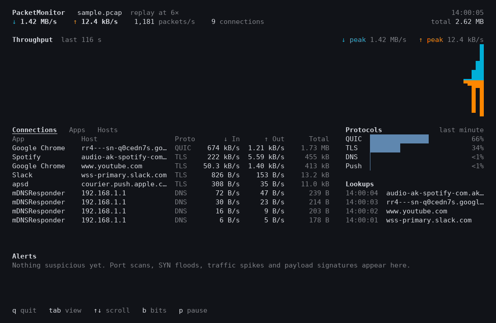

# PacketMonitor

[](https://github.com/HypothesisTester/PacketMonitor/actions/workflows/ci.yml)

See what your computer is talking to, live in the terminal: every connection
with the app that opened it and the host it reaches, and alerts for port
scans, SYN floods, traffic spikes and attack payloads. C++17 and libpcap,
nothing else. Runs on macOS and Linux.



<sub>The bundled sample capture, replayed at 6× with `packetmonitor --read build/sample.pcap --speed 6`.</sub>

## What it shows

- **Throughput** for the last few minutes, inbound growing up and outbound
  growing down, each with its own scale.
- **Connections, apps and hosts** (<kbd>tab</kbd> switches), with current
  rates and totals. App names come from the operating system's socket table;
  on macOS a helper process counts as its app, so Google Chrome Helper is
  Google Chrome. Hostnames come from the DNS answers on the wire and from the
  server name a TLS client sends in clear text, so encrypted connections are
  still labelled.
- **Protocols** over the last minute: TLS, QUIC, DNS, SSH, push notifications
  and so on.
- **Lookups**: recent DNS queries, including names that don't exist.
- **Alerts**, below.

## Detection

| Alert | What triggers it |
| --- | --- |
| Payload signature | One of 32 built-in rules: Log4Shell, Shellshock, Spring4Shell, SQL injection, cross-site scripting, path traversal, web shells, encoded PowerShell, scanners' user agents, passwords sent over plain HTTP, FTP or POP3, and the EICAR test file. |
| Port scan | One source trying 20 or more ports on one host within 10 seconds. |
| SYN flood | At least 100 connection attempts a second to one service, with under 20% completing the handshake. |
| Traffic spike | Inbound or outbound traffic far above this network's usual level for 3 seconds. |

Signatures are matched with **Aho–Corasick**: every rule is found in one pass
over the payload. Matching follows each TCP stream in sequence order, skipping
retransmitted bytes, so a pattern split across two packets is still found,
and found once. Rules live in [`data/signatures.txt`](data/signatures.txt) and
are compiled into the binary; `-s FILE` uses your own.

The spike detector works on log(1 + bytes per second), so going from 1 MB/s
to 20 MB/s counts the same as going from 10 kB/s to 200 kB/s. "Usual" is the
median of the last five minutes and the spread is the median absolute
deviation, so quiet seconds and short bursts barely move the baseline. It
alerts when traffic stays 4 spreads above the median, and above 1 MB/s, for 3
seconds in a row.

Thresholds can be changed with `--scan-ports`, `--flood-rate` and
`--spike-sigma`.

## Build

You need CMake, a C++17 compiler and libpcap.

- macOS: `xcode-select --install` and `brew install cmake` (libpcap comes with
  the system).
- Debian or Ubuntu: `sudo apt install cmake g++ libpcap-dev`.

```sh
cmake -B build -DCMAKE_BUILD_TYPE=Release
cmake --build build -j
```

## Run

Live capture needs root:

```sh
sudo ./build/packetmonitor                       # the active interface
sudo ./build/packetmonitor -i en0 -f "not port 22"
./build/packetmonitor --list                     # interfaces
```

To try it without root, replay the sample capture written by the build:

```sh
./build/packetmonitor --read build/sample.pcap
```

| Key | |
| --- | --- |
| <kbd>tab</kbd>, <kbd>1</kbd> <kbd>2</kbd> <kbd>3</kbd> | Connections, apps, hosts |
| <kbd>↑</kbd> <kbd>↓</kbd>, <kbd>PgUp</kbd> <kbd>PgDn</kbd> | Scroll |
| <kbd>b</kbd> | Rates in bits or bytes |
| <kbd>p</kbd> | Pause the display |
| <kbd>q</kbd> | Quit |

**Recording.** `-w capture.pcap` saves the packets, and the app behind each
connection to `capture.pcap.apps`. Replaying the file later shows the app
names too, and any tool that reads pcap files can open it.

**Without the dashboard.** `--headless` prints alerts as they happen (`--json`
for JSON lines), and `--log FILE` appends them to a file. With `--read`, it
goes through the file as fast as it can, so it also works for checking old
captures. [`contrib/packetmonitor.service`](contrib/packetmonitor.service)
runs it as a systemd service.

Run `packetmonitor --help` for everything else.

## How it works

```
 libpcap ─▶ capture thread ─▶ lock-free ring ─▶ engine thread ─▶ snapshot ─▶ dashboard
             copies packets     single producer,   decodes, tracks     once a       redraws only
             in, never waits    single consumer    flows, reads DNS    second       changed cells
                                                   and TLS, matches
                                                   rules, detects
```

- **Capture** runs on its own thread and only copies each packet into a 64 MB
  ring. The ring is lock-free with one producer and one consumer: records of
  any size sit end to end, and the two threads share nothing but two
  counters. Live capture never waits for the analysis, so if it falls behind,
  packets are dropped and counted rather than stalling the kernel's buffer;
  replays wait instead, so nothing is lost.
- **Decoding** handles Ethernet with VLAN tags, Linux cooked captures, BSD
  loopback and raw IP; IPv4 and IPv6 with extension headers; TCP options; and
  UDP. Every read is checked against the bytes actually captured.
- **The engine** keeps a table of flows with per-direction byte counts,
  rates, TCP handshake state, the stream positions used for matching, and the
  start of each TLS handshake until its server name has arrived. Its clock is
  the packets' timestamps, not the wall clock, so a replay gives exactly the
  results seen live. The tests rely on that.
- **App names** come from `/proc/net/*` and `/proc/<pid>/fd` on Linux, and
  from `libproc` on macOS (the API `lsof` uses), refreshed on a background
  thread every two seconds or as soon as a new connection is seen.
- **The dashboard** is drawn with a small renderer of its own rather than
  ncurses: it keeps a grid of styled cells and sends the terminal only the
  cells that changed since the last frame. It uses the terminal's own
  background and mid-tone colours, so it suits light and dark themes.

## Performance

| | Speed |
| --- | --- |
| Whole pipeline (sample capture × 20, 9.4 million packets) | 5.5 million packets/s |
| Signature matching, Aho–Corasick | 456 MB/s |
| Signature matching, one search per rule (as in version 1) | 127 MB/s |

On a 2.1 GHz Intel Xeon; the pipeline uses two threads, the matcher one.
Reproduce with
`packetmonitor --read build/sample.pcap --bench --repeat 20` and
`build/pm-bench-signatures`. Both run in CI, on Linux and macOS.

Matching is limited by memory latency, since each byte's lookup depends on
the one before, so the automaton is kept small: bytes that appear in no rule
share one column of the table, entries store the next row's offset rather
than its number, and at the start state the scanner skips bytes that can't
begin a rule in a loop with no such dependency. Exact-case and any-case
rules share one case-folded automaton; exact-case matches are confirmed
against the original bytes.

## Tests

```sh
ctest --test-dir build --output-on-failure
```

72 tests, run in CI on Linux and macOS, with and without AddressSanitizer and
UndefinedBehaviorSanitizer:

- the decoder, DNS and TLS parsers against hand-built packets, every
  truncation of a valid packet, and hundreds of thousands of random and
  mutated inputs;
- Aho–Corasick against a naive search on random inputs, and matching across
  every possible split point;
- the ring with a producer and a consumer thread passing 300,000 records;
- each detector on synthetic traffic, including cases that must not alert;
- the dashboard drawn at sizes from 20×5 to 250×80;
- the whole sample capture end to end: all five incidents found, once each,
  in order, and the same on every run.

## The sample capture

[`tools/make_sample.cpp`](tools/make_sample.cpp) writes `build/sample.pcap`
during the build: three minutes of a made-up laptop's traffic, built like the
real thing, with TCP handshakes, DNS answers that go through CNAMEs, a TLS
ClientHello split across two segments, and QUIC video over IPv6. It contains
five incidents:

| Time | Incident |
| --- | --- |
| 0:45 | A password sent to a NAS over plain HTTP |
| 1:10 | A port scan from another machine on the network |
| 1:35 | The EICAR test file downloaded over HTTP, split across two packets |
| 2:00 | A 30 MB/s software update |
| 2:40 | A SYN flood against a local development server |

[`tools/record_demo.py`](tools/record_demo.py) makes the GIF above from it.

## Limitations

- Out-of-order TCP segments reset matching for that stream rather than being
  put back in order, so a pattern spanning a reordering can be missed.
- QUIC encrypts its handshake, so QUIC connections are named from DNS only.
  With encrypted DNS (DNS over HTTPS, iCloud Private Relay) lookups aren't
  visible, and names come from TLS alone.
- A connection that opens and closes within a few milliseconds may be gone
  from the socket table before it is read, and then shows no app.
- IP fragments aren't reassembled.
